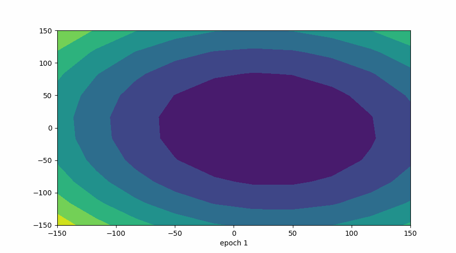

## mbgdregressor

This is a small library that tries to run mini batch gradient desent on your linear regression dataset which is not primitively implemented in sklearn library.


### Install
```sh
pip install gdregressor
```

### Usage
```py
>>> import numpy as np
>>> from gdregressor import Mbgdregressor
>>> from sklearn.datasets import load_diabetes

>>> X,y = load_diabetes(return_X_y=True)
>>> X_train,X_test,y_train,y_test = train_test_split(X,y,test_size=0.2,random_state=2)
>>> batch = X_train.shape[0]//20
>>> model = Mbgdregressor(batch_size= batch,learning_rate=0.01,epochs=100)
>>> model.fit(X_train,y_train)
>>> y_pred = model.predict(X_test)

```

### Performance
The provided graph presents a comparative analysis of the learning curve or descent trajectory for both stochastic gradient descent and mini-batch gradient descent. A noticeable observation from the graph is that the curve does not exhibit a completely random behavior, as observed in stochastic gradient descent method, nor does it appear to be perfectly linear as in batch gradient descent.




